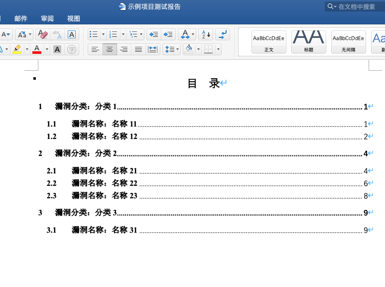
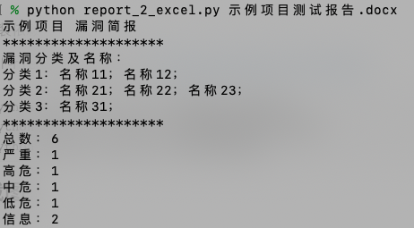
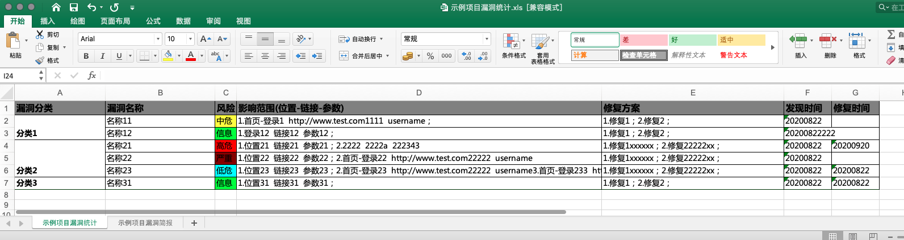

## python3 安全测试报告解析工具

@author [贰拾壹 ](https://github.com/er10yi)

### 概述 

很多公司都没有规范的安全测试报告模板，或即使有报告模板，也少对应的解析脚本。本项目旨在建立安全测试报告规范，提供一个docx格式的安全测试报告模板及python3解析脚本，规范漏洞报告并减少安全测试人员统计漏洞信息，规范漏洞入库标准。

### 文件说明

分类及名称.docx：用于规范漏洞一级分类，并给出二级分类的大致名称

报告格式说明.docx：用于说明报告格式，文档格式

示例项目测试报告.docx：瞎写的一个报告，用于测试结果是否正确

某项目测试报告.docx：**实际的报告模板**

### 用法

需要先安装依赖

pip install -r requirements.txt -i https://pypi.douban.com/simple/

```python
用法：python report_2_excel.py 报告名字 输出名称
例如：python report_2_excel.py 某项目测试报告 漏洞报告
或者：python report_2_excel.py 某项目测试报告
```

### 使用截图








